# Hi there, I'm Rony 👋

I am a **Senior Backend Engineer** passionate about building scalable architectural systems, optimizing performance, and solving complex data challenges. When I'm not designing robust APIs or untangling asynchronous control flows, I love diving into game development.

---

### 🛠️ Technical Toolkit

| Category | Technologies & Tools |
| :--- | :--- |
| **Backend, Core & Infrastructure** | Node.js, C#, Python, AWS |
| **Frontend** | HTML, CSS, JavaScript, TypeScript |
| **Data** | Redis, MySQL, MongoDB |
| **Architecture** | Asynchronous Control Flow, Event-Driven Design, Distributed Systems |
| **Game Dev** | Unity |

### 📊 GitHub Stats

  
  

---

### 📫 Connect with Me

* 💼 Connect on **[LinkedIn](https://www.linkedin.com/in/rony130)**
* 📧 Reach out via **[Email](mailto:rony13100@gmail.com)**
